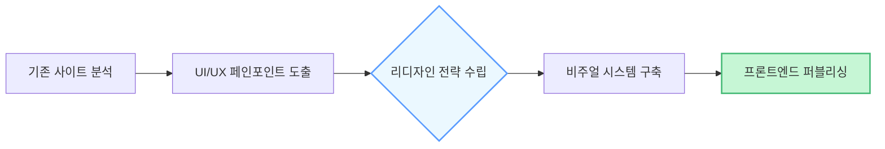
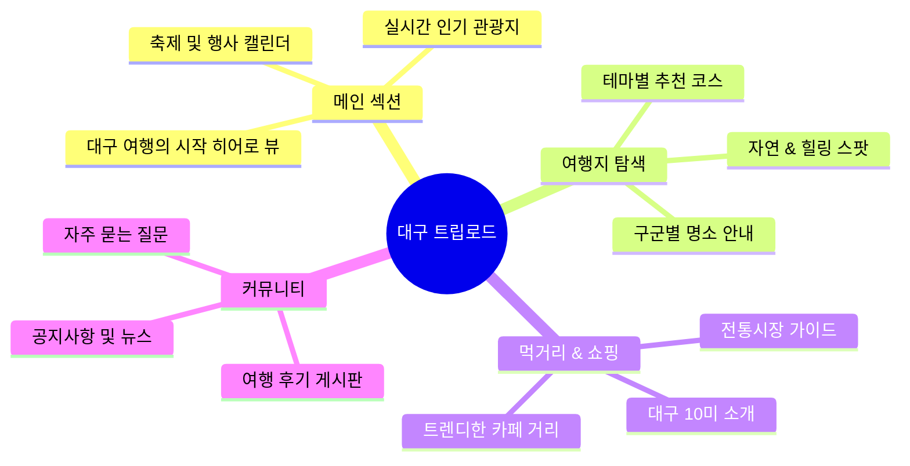

# 🏯 Daegu TripRoad: 웹 리디자인 프로젝트

> **"대구의 매력을 한눈에, 여행의 시작을 더 가볍게."**
> **기존 대구 관광 홈페이지의 정보 구조를 분석하고, 직관적인 UI와 현대적인 비주얼 시스템을 통해 사용자 경험을 혁신한 웹 리디자인 프로젝트입니다.**

---

## 🔗 프로젝트 아카이브

| 구분            | 링크                                                                                                                |
| --------------- | ------------------------------------------------------------------------------------------------------------------- |
| **배포 페이지** | [GitHub Pages: Daegu TripRoad](https://www.google.com/search?q=https://kny45112003-hue.github.io/redesign-project/) |
| **저장소**      | [GitHub: redesign-project](https://github.com/kny45112003-hue/redesign-project)                                     |

---

## 💎 프로젝트 핵심 가치 (Core Value)

| 가치                  | 설명                                                                                 |
| --------------------- | ------------------------------------------------------------------------------------ |
| **정보의 가시성**     | 복잡한 텍스트 위주의 나열에서 벗어나 이미지와 타이포그래피 중심의 시각적 가독성 확보 |
| **현대적 감성**       | 파스텔 톤의 컬러 시스템과 여백의 미를 활용하여 세련된 지역 관광 브랜드 이미지 구축   |
| **직관적 내비게이션** | 사용자가 원하는 여행 정보를 최소한의 클릭으로 찾을 수 있도록 메뉴 구조 재설계        |

---

## ⚙️ 리디자인 워크플로우 (Redesign Process)

단순한 디자인 수정을 넘어 **문제 분석 - 전략 수립 - 디자인 구현**의 단계를 거쳤습니다.

---

## 🎨 디자인 전략 (Visual Strategy)

대구의 역동성과 관광의 설레임을 전달하기 위해 새로운 디자인 가이드를 정의했습니다.

### 1. 컬러 시스템 (Color System)

- **Main Color**: `Sky Blue` - 대구의 맑은 하늘과 쾌적한 여행을 상징
- **Point Color**: `Light Green` - 자연과 휴식이 있는 관광 명소 강조
- **Sub Color**: `White` - 깔끔하고 현대적인 레이아웃의 기초

### 2. 디자인 개선점 (Before & After)

- **Before**: 공공기관 특유의 딱딱한 배치, 과도한 텍스트 정보, 일관성 없는 이미지 크기.
- **After**: 카드 뉴스 형태의 콘텐츠 배치, 감성적인 대형 히어로 섹션, 반응형 레이아웃 적용.

---

## 🛠 기술 스택 (Tech Blueprint)

### 개발 환경 (Frontend)

### 디자인 도구

---

## 🗺 정보 구조도 (IA)

---

## 🚀 주요 구현 포인트

- **반응형 웹 퍼블리싱**: 모바일 사용자가 많은 관광 사이트 특성을 고려하여 모든 디바이스에서 최적화된 화면 제공
- **인터랙션 디자인**: 스크롤 애니메이션과 호버 효과를 통해 사용자에게 즐거운 탐색 경험 제공
- **콘텐츠 큐레이션**: 방대한 데이터를 테마별(자연, 역사, 먹거리)로 분류하여 직관적인 카드 UI로 재구성

---

## 📈 프로젝트 의의

본 프로젝트는 기존 공공기관 웹사이트의 경직된 인터페이스를 탈피하여, **MZ세대를 포함한 다양한 연령층이 쉽고 즐겁게 접근할 수 있는 관광 플랫폼**의 가능성을 제시했습니다. 사용자 리서치를 기반으로 한 비주얼 리디자인을 통해 정보 전달력과 브랜드 신뢰도를 동시에 높이는 데 집중했습니다.

---

